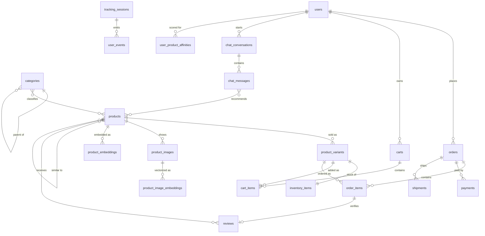

# DATABASE.md

Database reference for **SmartMart**. Full DDL + design rationale: `docs/database-schema.md`.

**Core features → entities:** `identity` (users, auth, addresses) · `catalog` (brands, categories, products, variants, images) · `inventory` · `cart` · `orders` (+ shipments, returns) · `payments` · `reviews` · `tracking` (behavior events → feeds all AI) · `recommendations` (affinities, similarities, embeddings) · `chat` (conversations, messages) · `visual-search` (image embeddings).

## 1. Overview

| Item | Value |
|---|---|
| Database | PostgreSQL **16+**; extensions `pgcrypto`, `citext`, `pg_trgm`, `ltree`, `vector` (pgvector ≥ 0.7) |
| ORM | **TypeORM 0.3.x** + `@nestjs/typeorm` — ⚠️ *confirm; Prisma is the alternative* |
| Migrations | TypeORM CLI, `/migrations`, **`synchronize: false` in every environment** |
| Connections | `pg` pool max 20/instance; PgBouncer (transaction mode) in prod |
| Schema | single `public` — module boundaries enforced in code, not by PG schemas |

**Naming:** tables `snake_case` **plural** (`product_variants`) · columns `snake_case` singular · FK `<singular>_id` · join tables both names alphabetical (`product_categories`) · index `<table>_<cols>_idx` · unique `<table>_<cols>_uq` · check `<table>_<rule>` · enum type `<entity>_<attr>` singular (`order_status`) · booleans `is_*`/`has_*` · timestamps `*_at`.

## 2. Entities by Feature

Key columns + indexes only; complete field lists in `docs/database-schema.md` §3.
† = registered denormalization (§4) ‡ = intentional FK omission

### `identity`
| Table | Key columns | Indexes |
|---|---|---|
| `users` | `id uuid PK`, `email citext`, `password_hash NULL` (OAuth), `status user_status`, `preferences jsonb`, `deleted_at` | `users_email_uq (email) WHERE deleted_at IS NULL`, `(status)` |
| `user_identities` | `id uuid PK`, `user_id FK CASCADE`, `provider`, `provider_user_id` | `UNIQUE (provider, provider_user_id)`, `(user_id)` |
| `roles` / `user_roles` | `roles.code text UNIQUE`; `user_roles PK (user_id, role_id)` | PK only |
| `auth_sessions` | `id uuid PK`, `user_id FK`, `refresh_token_hash UNIQUE`, `expires_at`, `revoked_at` | `(user_id) WHERE revoked_at IS NULL` |
| `user_addresses` | `id uuid PK`, `user_id FK`, `recipient_name`, `line1`, `city`, `country_code char(2)`, `is_default_shipping` | partial unique `(user_id) WHERE is_default_shipping` |

### `catalog`
| Table | Key columns | Indexes |
|---|---|---|
| `brands` | `id uuid PK`, `name`, `slug citext UNIQUE` | slug |
| `categories` | `id uuid PK`, `parent_id FK RESTRICT` (self), `slug citext UNIQUE`, `path ltree`†, `is_active` | `(parent_id)`, GiST `(path)` |
| `products` | `id uuid PK`, `brand_id FK SET NULL`, `slug citext`, `status product_status`, `base_price numeric(12,2)`, `attributes jsonb`, `tags text[]`, `rating_avg`†, `rating_count`†, `total_sold`†, `search_vector tsvector GENERATED`, `deleted_at` | `slug_uq WHERE deleted_at IS NULL`, `(status, published_at DESC)`, GIN `search_vector`, GIN trgm `(name)`, GIN `attributes jsonb_path_ops`, GIN `(tags)`, partial B-tree `(base_price)`, `(rating_avg DESC)` |
| `product_categories` | `PK (product_id, category_id)`, `is_primary` | `(category_id, product_id)`, partial unique `WHERE is_primary` |
| `product_options` | `id uuid PK`, `product_id FK CASCADE`, `name` | `UNIQUE (product_id, name)` |
| `product_option_values` | `id uuid PK`, `option_id FK CASCADE`, `value`, `metadata jsonb` | `UNIQUE (option_id, value)` |
| `product_variants` | `id uuid PK`, `product_id FK CASCADE`, `sku citext`, `price numeric(12,2)`, `option_summary jsonb`†, `is_active`, `deleted_at` | `sku_uq WHERE deleted_at IS NULL`, `(product_id) WHERE is_active` |
| `product_variant_option_values` | `PK (variant_id, option_value_id)` | `(option_value_id)` |
| `product_images` | `id uuid PK`, `product_id FK CASCADE`, `variant_id FK SET NULL`, `url`, `is_primary`, `checksum` | `(product_id, position)`, partial unique `WHERE is_primary` |

### `inventory` · `cart`
| Table | Key columns | Indexes |
|---|---|---|
| `inventory_items` | `variant_id uuid PK/FK` (**1:1**), `quantity_on_hand`, `quantity_reserved`, `quantity_available GENERATED STORED` | partial `WHERE quantity_available <= 5` |
| `inventory_movements` | `id bigint IDENTITY PK`, `variant_id FK`, `type`, `quantity_delta`, `reference_type/_id` | `(variant_id, created_at DESC)`, `(reference_type, reference_id)` |
| `carts` | `id uuid PK`, `user_id FK NULL`, `anonymous_id NULL`, `status cart_status`, CHECK owner present | partial unique active cart per user / per anon; `(updated_at) WHERE status='active'` |
| `cart_items` | `id uuid PK`, `cart_id FK CASCADE`, `variant_id FK RESTRICT`, `quantity`, `price_at_add`, `added_from`, `source_ref jsonb` | `UNIQUE (cart_id, variant_id)` |

### `orders` · `payments` · `reviews`
| Table | Key columns | Indexes |
|---|---|---|
| `orders` | `id uuid PK`, `order_number UNIQUE`, `user_id FK NULL` (guest), `email citext`, `status order_status`, `subtotal/discount/shipping/tax/total numeric(12,2)`, `shipping_address jsonb`†, `billing_address jsonb`† | `(user_id, placed_at DESC)`, `(status, placed_at DESC)`, `(email, placed_at DESC)`, **BRIN** `(placed_at)` |
| `order_items` | `id uuid PK`, `order_id FK CASCADE`, `product_id/variant_id FK SET NULL`, `product_name`†, `sku`†, `unit_price`†, `quantity`, `attribution jsonb` | `(order_id)`, `(product_id)`, `(variant_id)` |
| `order_status_history` | `id bigint PK`, `order_id FK`, `from_status`, `to_status`, `changed_by` | `(order_id, created_at)` |
| `shipments` | `id uuid PK`, `order_id FK`, `carrier`, `tracking_number`, `tracking_events jsonb` | `(order_id)`, `(carrier, tracking_number)` |
| `order_returns` | `id uuid PK`, `order_id FK`, `order_item_id FK`, `quantity`, `status`, `refund_amount` | `(order_id)` |
| `payments` | `id uuid PK`, `order_id FK RESTRICT`, `provider`, `provider_payment_id`, `status payment_status`, `amount`, `idempotency_key UNIQUE`, `provider_payload jsonb` | `(order_id, created_at DESC)`, unique `(provider, provider_payment_id)` |
| `payment_refunds` | `id uuid PK`, `payment_id FK RESTRICT`, `order_return_id FK NULL`, `amount`, `status` | `(payment_id)` |
| `reviews` | `id uuid PK`, `product_id FK CASCADE`, `user_id FK CASCADE`, `order_item_id FK NULL` (verified), `rating smallint 1–5`, `status review_status` | `UNIQUE (product_id, user_id)`, `(product_id, created_at DESC) WHERE status='published'` |
| `review_votes` | `PK (review_id, user_id)`, `is_helpful` | PK only |

### `tracking` (AI input)
| Table | Key columns | Indexes |
|---|---|---|
| `tracking_sessions` | `id uuid PK`, `user_id FK NULL`, `anonymous_id NOT NULL`, `device jsonb`, `utm jsonb`, `ip inet` | `(user_id, started_at DESC)`, `(anonymous_id, started_at DESC)` |
| `user_events` | `PK (id bigint, occurred_at)`, **`PARTITION BY RANGE (occurred_at)`** monthly, `event_type user_event_type`, `user_id`/`product_id`‡, `properties jsonb` | `(user_id, occurred_at DESC)`, `(anonymous_id, …)`, `(product_id, …)`, `(event_type, …)`, GIN `properties` |

### `recommendations` · `chat` · `visual-search`
| Table | Key columns | Indexes |
|---|---|---|
| `user_product_affinities` | `PK (user_id, product_id)`, `score real`, `signals jsonb`, `model_version` | `(user_id, score DESC)` |
| `product_similarities` | `PK (product_id, similar_product_id, algorithm)`, `score`, CHECK no self-ref | `(product_id, algorithm, score DESC)` |
| `user_preference_embeddings` | `user_id uuid PK/FK`, `embedding vector(768)`, `model_version` | PK |
| `product_embeddings` | `id bigint PK`, `product_id FK CASCADE`, `embedding vector(1536)`, `model_version`, `is_active`† | **HNSW** `vector_cosine_ops (m=16, ef_construction=64)`, `UNIQUE (product_id, model_version)` |
| `chat_conversations` | `id uuid PK`, `user_id FK NULL`, `anonymous_id NULL`, `status`, `context jsonb`, `message_count`†, token totals† | `(user_id, last_message_at DESC)`, `(anonymous_id, …)` |
| `chat_messages` | `id bigint PK`, `conversation_id FK CASCADE`, `role chat_role`, `content`, `tool_calls jsonb`, `input/output_tokens`, `latency_ms` | `(conversation_id, created_at)` |
| `chat_message_products` | `PK (message_id, product_id)`, `position`, `retrieval_score`, `reason` | `(product_id)` |
| `chat_message_feedback` | `message_id bigint PK/FK`, `rating smallint IN (-1,1)` | PK |
| `product_image_embeddings` | `id bigint PK`, `image_id FK CASCADE`, `product_id`†, `embedding vector(512)`, `model_name/_version`, `is_active`† | **HNSW** `vector_cosine_ops`, `(product_id)`, `UNIQUE (image_id, model_name, model_version)` |
| `visual_search_queries` | `id uuid PK`, `user_id FK NULL`, `image_url`, `image_checksum`, `embedding vector(512)`, `result_product_ids uuid[]` | `(image_checksum)` (cache), `(user_id, created_at DESC)` |

**Shared entities** (read by ≥ 3 features, owned by one module, accessed via that module's exported service): `users`, `products`, `product_variants`, `orders`. Enums are PG types declared in the shared migration and mirrored in `shared/enums/`.

## 3. Relationships



**Conventions** — `CASCADE` only for owned children (`order_items`, `cart_items`, `chat_messages`). `RESTRICT` for anything financial or referenced by history (`payments.order_id`, `cart_items.variant_id`). `SET NULL` where history must outlive the parent (`orders.user_id`, `order_items.product_id`). M:N is always an explicit join table with composite PK — never an array column. Nullable FKs only for guest flows.

**Cross-feature** — `orders → catalog` (snapshots name/SKU/price at checkout) · `chat → catalog` via `chat_message_products` · `chat → recommendations` (RAG reads `product_embeddings`; chat owns no embedding table) · `recommendations → tracking` (batch job reads `user_events`) · `visual-search → catalog` · `cart → orders` (`cart_items.source_ref` → `order_items.attribution`, the AI revenue-attribution chain).
**Rule:** the three AI features depend on `catalog` + `tracking`; nothing depends on them. Any AI module can be disabled without breaking checkout.

## 4. Conventions

**Primary keys** — `uuid` (`gen_random_uuid()`) for entities exposed in URLs/APIs: non-enumerable, client-generatable, mergeable across environments. `bigint GENERATED ALWAYS AS IDENTITY` for high-volume append-only tables (`user_events`, `chat_messages`, `inventory_movements`, embeddings): ~2× smaller indexes at 100M+ rows. On PG 18 use `uuidv7()` for time-ordered UUIDs.

**Soft delete** — `deleted_at timestamptz NULL` on `users`, `products`, `product_variants`, `user_addresses` **only**; everywhere else delete for real. Every unique index on a soft-deletable table must be partial (`WHERE deleted_at IS NULL`). Reads go through a repository base class that appends the filter — forgetting it is the #1 bug source here.

**Timestamps** — `created_at timestamptz NOT NULL DEFAULT now()` on every table; `updated_at` on mutable tables maintained by the `set_updated_at()` **trigger**, not the ORM (bulk SQL updates must be covered). Always UTC; convert in the presentation layer.

**Enums** — native PG types for closed, stable sets (`order_status`, `chat_role`, `payment_status`). `ALTER TYPE … ADD VALUE` is non-blocking but **cannot run inside a transaction** — give it its own migration. Never remove values; deprecate in code. Use `text` + CHECK for sets that churn (`shipments.status`). Mirror each PG enum as a TS enum in `shared/enums/`.

**Money** — `numeric(12,2)` + `currency_code char(3)`. Never `float`.

**Denormalization (†)** — permitted only when registered in `docs/database-schema.md` §5 with an owner and a rebuild path. Current set: `products.rating_avg/rating_count/total_sold`, `product_variants.option_summary`, `categories.path`, order/order-item snapshots, `chat_conversations` counters, and `product_id`/`is_active` mirrored onto embedding tables (required for pgvector pre-filtering).

## 5. Migration Rules

**Naming** — `{unix_timestamp}-{PascalCaseDescription}.ts`, e.g. `1753900000000-AddProductImageEmbeddings.ts`; class name matches the file.

**Versioning** — forward-only, one logical change per migration, one migration per PR. Never edit a migration merged to `main` — ship a new one. CI runs migrations against a restored staging snapshot before deploy.

**Rollback** — every migration implements a tested `down()`. In production prefer a forward fix; `down()` exists for the deploy-window rollback only. Practically irreversible migrations (data backfills, `DROP COLUMN`) say so in a header comment and ship in their own PR.

**Zero-downtime column change** — expand → migrate → contract: add nullable + batched backfill → deploy code writing both → set `NOT NULL` / drop old column in a later release.

**Locking** — `CREATE INDEX CONCURRENTLY` on tables > 1M rows (needs `transaction: false`). Set `lock_timeout = '5s'` and `statement_timeout` so blocked DDL fails fast instead of queuing every query behind it.

**Raw SQL required** (not modelled by the ORM): extensions, partitions, generated columns, GIN/GiST/BRIN/HNSW and partial indexes, triggers, enum alterations.

## 6. TypeORM + PostgreSQL Specifics

**Entity placement** — entities live with their feature (`src/modules/catalog/entities/product.entity.ts`), registered via `TypeOrmModule.forFeature([...])`. A module must not import another module's entity file; cross-feature reads go through the owning module's exported service.

**Config** — `synchronize: false` and `migrationsRun: false` everywhere including local dev; `logging: ['error','warn','migration']`.

| PG type | Decorator |
|---|---|
| `uuid` PK | `@PrimaryGeneratedColumn('uuid')` |
| `numeric(12,2)` | `@Column('numeric', { precision: 12, scale: 2, transformer: decimalTransformer })` — **required**, else `pg` returns a string |
| `jsonb` | `@Column('jsonb', { default: {} })` |
| `timestamptz` | `@CreateDateColumn({ type: 'timestamptz' })` / `@UpdateDateColumn` |
| `text[]` | `@Column('text', { array: true, default: {} })` |
| PG enum | `@Column({ type: 'enum', enum: OrderStatus })` |
| `vector(n)` | `@Column('text', { transformer: vectorTransformer })` — no native support |
| generated / `tsvector` | `@Column({ select: false, insert: false, update: false })` |

**pgvector** — no TypeORM type; use a transformer (`number[] ⇄ '[0.1,0.2,…]'`) and raw SQL for ANN:
```ts
await ds.query(
  `SELECT product_id, MIN(embedding <=> $1::vector) AS distance
   FROM product_image_embeddings
   WHERE is_active AND model_version = $2
   GROUP BY product_id ORDER BY distance LIMIT $3`,
  [toVector(queryEmbedding), MODEL_VERSION, 20]);
```
Set `hnsw.ef_search` per session (default 40; 100 for recall-sensitive paths). Never declare HNSW indexes via `@Index()`.

**Partitioned tables** — TypeORM reads/inserts through the `user_events` parent but cannot manage partitions: create next month's via scheduled migration or `pg_partman`. For retention use `DETACH PARTITION`, never `.delete()`.

**Transactions** — checkout runs in one `QueryRunner` transaction: `SELECT … FOR UPDATE` on `inventory_items` → write `inventory_movements` → create order + items → convert cart. Read-committed is sufficient given the row lock.

**Query gotchas** — `find({ relations })` generates `LEFT JOIN`s that explode on `products → variants → option_values`; use QueryBuilder with explicit selects on hot paths. `take`/`skip` with joins triggers a subquery — `EXPLAIN ANALYZE` every endpoint on `products` or `orders` before shipping.

**Read replica** — recommendation batch jobs and analytics read from a replica. The "For You" feed may be seconds stale (acceptable); never read back a just-written order from the replica.
