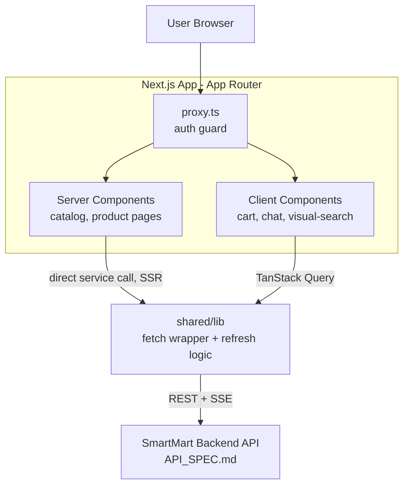
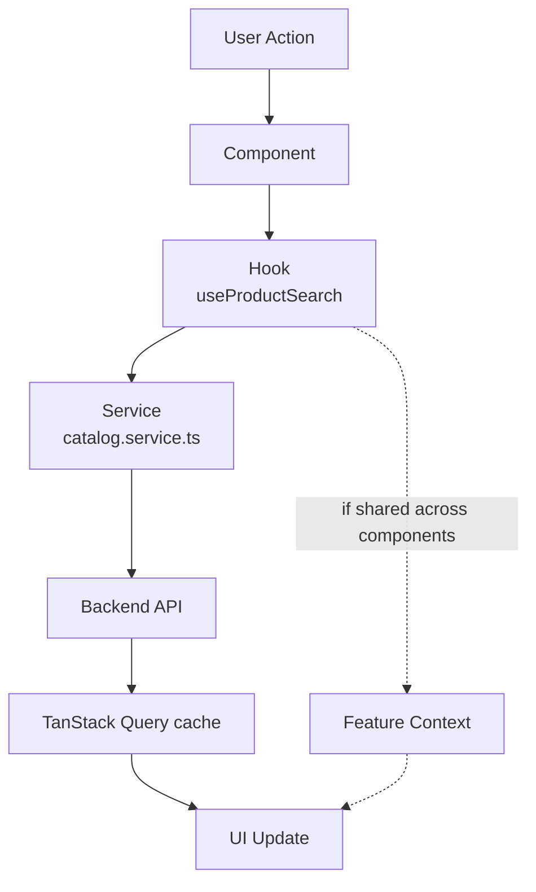
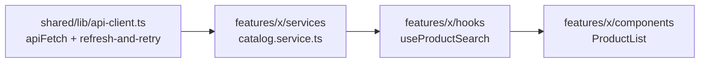

# ARCHITECTURE.md — SmartMart Frontend

Feature-based Next.js. Read alongside `PROJECT-RULES.md` (conventions, testing, git) and `API_SPEC.md` (backend contract — auth flow, response envelope, SSE). Audience: new engineers and AI coding assistants.

## 1. Overview

SmartMart's frontend is a **single Next.js 14 (App Router) app**, organized by feature rather than by layer — routes in `app/` stay thin and just compose components exported from `features/*`.

**Why feature-based:** the same reasons as the backend (`ARCHITECTURE.md` §1) — change locality, and a `features/chat/` an AI assistant can work in without loading the whole app. It also mirrors the backend's `modules/` 1:1, so "the chat feature" means the same folder shape on both sides.

**Tech stack justification:**
- **Next.js App Router** — the product catalog is SEO- and perf-sensitive (public product pages), while cart/chat/visual-search are highly interactive. Server Components render catalog pages with near-zero client JS; `'use client'` is opt-in only where interactivity is needed.
- **TanStack Query** — the backend is a REST API with a `success/data/meta` envelope and cursor pagination (`API_SPEC.md` §3–4); Query gives caching, retry, and background refetch for free instead of hand-rolled `useEffect` fetching.
- **React Context** — deliberately minimal global state (auth session, cart badge, theme) without adding a state-management dependency; feature-local state that outlives a component still starts with `useState`/`useReducer` in a feature-local context before reaching for anything global.
- **Tailwind CSS** — utility-first, no CSS-in-JS runtime cost, keeps styles co-located with the 5–10 person team's component-per-file convention.
- **`fetch` (native)** — one wrapper (`apiFetch` in `shared/lib/api-client.ts`) handles `Authorization: Bearer` attachment and silent token refresh on `401 AUTH_TOKEN_EXPIRED` (`API_SPEC.md` §2) for every feature service, in one place; chosen over Axios specifically to use Next.js's built-in `fetch` caching (`next: {revalidate}`) for public data later (catalog, etc).



## 2. Folder Structure

```
src/
├── app/                           # Next.js App Router — entry point, routes, providers
│   ├── layout.tsx                 # root layout: QueryClientProvider, ThemeProvider
│   ├── proxy.ts              # auth guard for protected route groups
│   ├── (public)/                  # no auth required
│   │   └── products/[slug]/page.tsx
│   ├── (shop)/                    # optional-auth (guest checkout allowed)
│   │   └── cart/page.tsx
│   └── (account)/                 # protected — redirects to /login if no session
│       └── orders/page.tsx
├── shared/
│   ├── components/                # design-system primitives (Button, Modal, Toast)
│   ├── hooks/                     # useDebounce, useMediaQuery
│   ├── lib/                       # base API client — see note below
│   │   ├── auth-token.ts          # access token held outside React, for apiFetch's retry logic
│   │   ├── api-client.ts          # fetch wrapper (apiFetch), Authorization attach, refresh logic
│   │   ├── query-client.ts        # TanStack QueryClient config
│   │   └── sse-client.ts          # shared SSE stream reader used by chat
│   ├── context/
│   │   ├── session-context.tsx    # auth: user, loading state (token lives in shared/lib/auth-token.ts)
│   │   └── ui-context.tsx         # theme, nav drawer — the only other global context
│   ├── providers/
│   │   └── providers.tsx          # composes QueryClientProvider + SessionProvider, mounted in app/layout.tsx
│   ├── types/                     # API envelope types, shared enums (mirror backend)
│   └── utils/                     # formatCurrency, cn() classnames helper
├── features/
│   ├── product-catalog/
│   ├── cart/
│   ├── orders/
│   ├── chat/
│   └── visual-search/
├── assets/                        # static images, icons, fonts
└── styles/
    └── globals.css                # Tailwind base + design tokens
```

**Note on `shared/lib/` vs. the template's `shared/services/`:** `PROJECT-RULES.md` §1 already establishes `shared/lib/` as the base API/infra layer name — kept as-is here rather than introducing a second name for the same folder. Functionally it *is* the "shared API client" layer the template describes.

## 3. Feature Anatomy

```
features/chat/
├── components/
│   └── ChatWindow.tsx
├── hooks/
│   └── useChatStream.ts          # wraps shared/lib/sse-client.ts
├── services/
│   └── chat.service.ts           # calls shared/lib/api-client.ts
├── context/
│   └── chat-draft-context.tsx    # feature-local Context, e.g. unsent draft text
├── types/
│   └── chat.types.ts
├── utils/
│   └── format-timestamp.ts
├── index.ts                      # public barrel — only import surface
└── context.md                    # purpose, public API, invariants
```

No `pages/` subfolder: in App Router, routes live in `app/`, not inside the feature. A route file (`app/(shop)/chat/page.tsx`) just renders `<ChatWindow />` imported from `features/chat`.

## 4. Data Flow



- **Server state** (API data) never lives in a Context — TanStack Query is the single source of truth, keyed by feature (`['products', filters]`).
- **Feature context** only holds client-only state that outlives a single component and isn't server data (draft form values, open/closed UI toggles shared across siblings).

## 5. Cross-feature Communication

| Method | Use case | Preference |
|---|---|---|
| **URL / Router** | Filters, selected tab, product id — features compose at the route, not directly | First choice |
| **Global context** | Auth/session, cart badge count, theme — `shared/context/` only | Minimal, cross-cutting only |
| **Event emitter** | Decoupled side effects, e.g. `chat` emits `product-added-to-cart` so `cart` refetches without importing it | Rare — last resort |

No feature imports another feature's internals — only its `index.ts` (`PROJECT-RULES.md` §3).

## 6. Routing Structure

- **Public routes** — `(public)` group: product listing/detail, category pages, brand pages, login/register. Rendered as Server Components, statically generated or ISR-revalidated (product pages: `revalidate: 300`).
- **Protected routes** — `(account)` group: order history, addresses, saved payment methods. `proxy.ts` checks the session cookie; redirects to `/login?redirect=` on miss.
- **Optional-auth routes** — `(shop)` group: cart, checkout, chat — work for both guest (`X-Anonymous-Id`) and authenticated users per `API_SPEC.md` §2.
- **Route config per feature** — each feature owns only its components; the route file in `app/` is the only place that maps a URL to a feature's exported page component. Feature folders are not aware of their own URL.
- **Lazy loading** — Next.js code-splits per route automatically. Heavy, rarely-used client widgets (visual-search image uploader, chat window) are additionally wrapped in `next/dynamic({ ssr: false })` so they don't inflate the initial bundle of pages that merely link to them.

## 7. State Management Strategy

| State Type | Location | Example |
|---|---|---|
| Server state | TanStack Query (per-feature `hooks/`) | Product list, cart contents, order history |
| Global UI | `shared/context/ui-context.tsx` | Theme, nav drawer open |
| Auth | `shared/context/session-context.tsx` + `shared/lib/auth-token.ts` (token, outside React) | User, access token, cart badge count |
| Feature state | `features/[x]/context/*-context.tsx` | Catalog filter draft, chat input draft |
| Local UI | Component `useState` | Modal open, hover/focus state |

## 8. API Layer



- `shared/lib/api-client.ts` is the **only** place `fetch` is called against the backend; it owns base URL, `Authorization` attach (reading the token from `shared/lib/auth-token.ts`), and the `401 AUTH_TOKEN_EXPIRED` refresh-and-retry loop.
- Feature services call `apiFetch` and return typed data (or throw `ApiError` carrying the `error.code` from `API_SPEC.md` §5) — never a raw `Response`.
- Hooks are the **only** place `useQuery`/`useMutation` appears; components never touch TanStack Query directly.

## 9. Shared vs. Features

| Shared | Features |
|---|---|
| UI primitives (`Button`, `Modal`, `Toast`) — no domain awareness | Domain components (`ProductCard`, `ChatWindow`) |
| API client, query client, SSE client | Feature services (`catalog.service.ts`, `chat.service.ts`) |
| Global hooks (`useDebounce`, `useMediaQuery`) | Feature hooks (`useProductSearch`, `useChatStream`) |
| Generic utilities (`formatCurrency`, `cn()`) | Feature-specific utils (`format-timestamp.ts` for chat) |

## [Next.js-Specific Additions]

- **Server vs. Client boundary:** default every component to a Server Component; add `'use client'` only at the leaf that needs hooks/state/interactivity (a form, a query hook, a Context consumer) — not at the top of a whole feature.
- **SSR/SSG/ISR:** product/category/brand pages are ISR (`revalidate`) for freshness without a rebuild; cart/orders/chat are fully dynamic (`force-dynamic` or client-fetched) since they're per-user.
- **Streaming & Suspense:** product detail pages wrap the "similar products" / "reviews" sections in `<Suspense>` so the primary content (price, add-to-cart) isn't blocked on slower recommendation queries.
- **Images:** all product imagery goes through `next/image` for automatic optimization/CDN sizing; the visual-search upload widget is the one place raw `<input type="file">` is used, not `next/image`.
- **`proxy.ts`:** the single place route-group auth is enforced — feature code never re-checks auth itself, it trusts the route already gated it.
