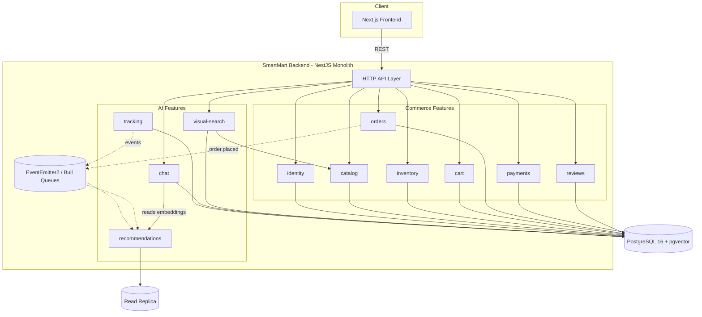
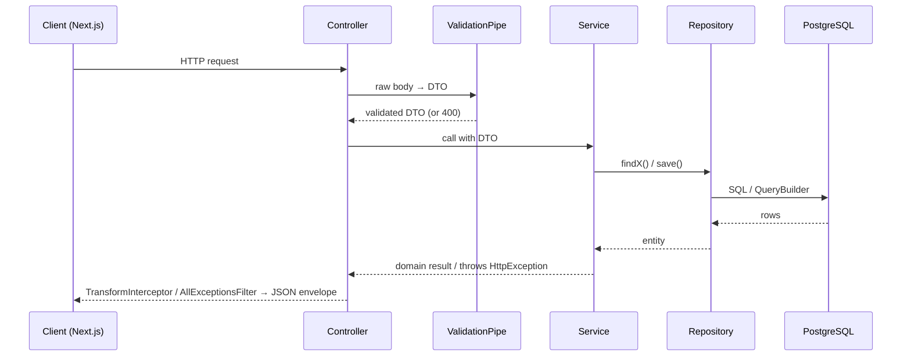
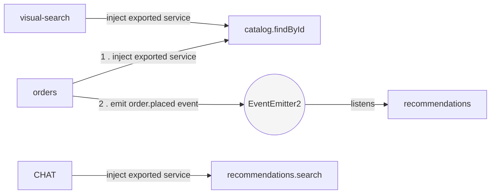

# ARCHITECTURE.md — SmartMart Backend

Feature-based NestJS monolith. Read alongside `PROJECT-RULES.md` (conventions, testing, git) and `DATABASE.md` (schema, TypeORM specifics). Audience: new engineers and AI coding assistants — when in doubt, follow this file over inferred patterns.

## 1. System Overview

SmartMart is a **single deployable NestJS monolith** (not microservices) serving a Next.js frontend. Modularity is enforced by *code organization*, not process boundaries — this keeps ops simple for a 5–10 person team while the feature-folder rule keeps the codebase from decaying into a tangled layer-based monolith as it grows.



**Why feature-based, not layer-based:**
- **Change locality** — a "shopping cart" bug fix touches one folder, not `controllers/`, `services/`, and `repositories/` scattered across the repo.
- **Independent AI features** — `recommendations`, `chat`, `visual-search` only depend on `catalog` + `tracking` (see `DATABASE.md` §3); any AI feature can be disabled without breaking checkout. Layer-based folders make this dependency direction invisible.
- **Team scaling** — as the team grows past 10, a feature folder becomes a natural PR/ownership boundary (`PROJECT-RULES.md` §6) or eventually an extraction candidate — without a rewrite.
- **AI-assistant friendliness** — a coding agent given "fix the chat feature" only needs `modules/chat/` in context, not the whole repo.

## 2. Folder Structure

```
src/
├── main.ts                      # bootstrap: global ValidationPipe, filters, interceptors
├── app.module.ts                 # root module, imports every feature + core + shared
├── config/                       # env schema + per-feature config namespaces
│   ├── env.validation.ts         # Joi/zod schema, validated at boot
│   └── configuration.ts          # registerAs() aggregator
├── core/                         # infrastructure, framework wiring — no business logic
│   ├── database/
│   │   ├── database.module.ts    # TypeOrmModule.forRootAsync(), global
│   │   └── migrations/           # TypeORM CLI migrations (see DATABASE.md §5)
│   ├── logger/
│   │   └── logger.module.ts      # Nest Logger config, log levels per env
│   └── cache/
│       └── cache.module.ts       # Redis/CacheModule, exported DI token
├── shared/                       # reusable, feature-agnostic code — no business logic
│   ├── dto/                      # PaginationDto, IdParamDto
│   ├── enums/                    # TS mirrors of every PG enum (DATABASE.md §4)
│   ├── decorators/                # @CurrentUser(), @Public()
│   ├── filters/                  # AllExceptionsFilter
│   ├── interceptors/              # TransformInterceptor
│   ├── middlewares/                # request-id, correlation-id
│   ├── events/                   # typed event payload classes (cart.checked_out, etc.)
│   ├── guards/                   # JwtAuthGuard
│   ├── utils/                    # decimalTransformer, vectorTransformer
│   └── types/                    # cross-feature shared type contracts
└── modules/                      # ← "features" (named `modules/` per PROJECT-RULES.md;
    ├── identity/                 #    functionally identical to a `features/` folder)
    ├── catalog/
    ├── inventory/
    ├── cart/
    ├── orders/
    ├── payments/
    ├── reviews/
    ├── tracking/
    ├── recommendations/
    ├── chat/
    └── visual-search/
```

**`core/` vs top-level `config/`:** `config/` is static, declarative env schema; `core/` contains actual Nest modules/providers (connections, loggers, cache clients) consumed via DI. Both are infrastructure — neither contains domain logic.

## 3. Feature Anatomy

Every feature under `modules/` follows the same shape (full rules: `PROJECT-RULES.md` §1–2, §8):

```
modules/chat/
├── chat.controller.ts         # HTTP routes, DTO validation, response shaping only
├── chat.module.ts             # @Module — exports ChatService only, never repositories/entities
├── chat.config.ts             # registerAs('chat', () => ({...}))
├── services/
│   └── chat.service.ts        # business logic, orchestrates repositories + other features' services
├── repositories/
│   └── chat.repository.ts     # all SQL/QueryBuilder calls live here — nowhere else
├── dto/
│   ├── send-message.dto.ts
│   └── chat-response.dto.ts
├── entities/
│   ├── chat-conversation.entity.ts
│   └── chat-message.entity.ts
├── types/
│   └── chat.types.ts
├── utils/
│   └── token-counter.util.ts
├── guards/                    # feature-specific guards only (rare)
├── tests/
│   ├── chat.service.spec.ts
│   └── chat.e2e-spec.ts
└── context.md                 # feature purpose, owned tables, public API, invariants
```

`context.md` is the single most important file for onboarding + AI assistants: it states what the feature owns (e.g. `chat` owns `chat_conversations`/`chat_messages`/`chat_message_products`/`chat_message_feedback` — but **not** embeddings, which live in `recommendations`), what it exposes, and what must never break.

## 4. Request Flow



| Layer | Owns | Never does |
|---|---|---|
| **Controller** | Routing, DTO binding, delegating to service, response shape (via global interceptor) | Business rules, direct DB/repository access |
| **Service** | Business logic, transactions, calling other features' services/events | Raw SQL, returning entities to the controller |
| **Repository** | All SQL/QueryBuilder, soft-delete filter (`DATABASE.md` §4) | Business rules, HTTP concerns |

Long-running AI inference (embeddings, recommendation batches) is dispatched to a Bull queue from the service — the controller returns immediately (`PROJECT-RULES.md` §8).

## 5. Cross-Feature Communication



**Allowed, in order of preference** (`PROJECT-RULES.md` §3):
1. **Shared exported service** — `import { CatalogService } from '../catalog/catalog.service'`; inject and call its public method.
2. **Domain events** (`EventEmitter2`) — for side effects that shouldn't block the caller: `order.placed` → `recommendations` updates affinities asynchronously.
3. **Shared DI tokens** — cross-cutting concerns only (cache client, config), via `shared/` / `core/`.

**Forbidden:**
```ts
// ❌ reaching into another feature's internals
import { ProductRepository } from '../catalog/repositories/product.repository';
import { Product } from '../catalog/entities/product.entity';

// ✅ go through the exported service
import { CatalogService } from '../catalog/catalog.service';
```
No two feature modules may import each other's `.module.ts` (circular imports are a lint failure) — extract a shared contract into `shared/` or use events instead.

## 6. Shared vs Core

| | `shared/` | `core/` |
|---|---|---|
| **Contains** | Reusable domain-adjacent code: DTOs, enums, decorators, filters, interceptors, event payloads, utils, types | Infrastructure setup: DB connection, logger, cache client |
| **Nature** | Stateless helpers, pure functions, type contracts | Stateful providers registered once, globally, via DI |
| **Imported by** | Any feature, freely | `app.module.ts` mostly; features inject via DI token, not direct import |
| **Example** | `PaginationDto`, `OrderStatus` enum, `AllExceptionsFilter` | `DatabaseModule` (`TypeOrmModule.forRootAsync`), `CacheModule` |
| **Rule of thumb** | "Would two unrelated features both plausibly import this?" | "Is this a singleton the whole app boots once?" |

## 7. Configuration Management

- **Env variables** validated once at boot (`config/env.validation.ts`); the app **fails fast** on a missing/malformed var rather than crashing later mid-request.
- **Config files:** one `<feature>.config.ts` per module registering its own namespace — `registerAs('chat', () => ({ maxTokens: ..., model: ... }))` — injected via typed `ConfigService`, never raw `process.env` outside `shared/config`.
- **Secrets** (API keys, DB credentials) come from env/secret manager only — `ConfigService.get('PAYMENT_API_KEY')`, never hardcoded (`PROJECT-RULES.md` §5).
- **Database config:** `synchronize: false`, `migrationsRun: false` in every environment, including local — migrations are the only schema change path (`DATABASE.md` §6).

## 8. NestJS-Specific Notes

- **DI boundary = export boundary.** A feature's `@Module` exports its service(s) only; TypeORM entities/repositories registered via `TypeOrmModule.forFeature([...])` are never exported.
- **Global providers** (`ValidationPipe`, `TransformInterceptor`, `AllExceptionsFilter`, `JwtAuthGuard`) are registered once in `main.ts`/`AppModule`, sourced from `shared/`.
- **Middleware chain:** correlation-id middleware (`shared/middlewares/`) → `JwtAuthGuard` → `ValidationPipe` → controller → `TransformInterceptor`/`AllExceptionsFilter`.
- **Events:** typed payload classes in `shared/events/`, names `<feature>.<past-tense-verb>` (`cart.checked_out`, `payment.captured`).
- **Async work:** `@nestjs/bull` queues live inside the *owning* feature (e.g. `modules/recommendations/queues/`), not in `shared/` — queue processors are business logic.
